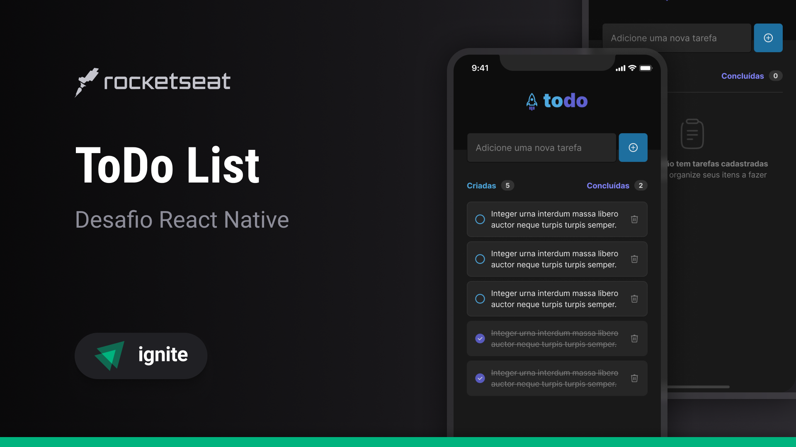

# Indice

- [Sobre](#-sobre)
- [Tecnologias](#Tecnologias)
- [Download](#Download)
- [Como baixar o projeto](#-como-baixar-o-projeto)

## 🔖&nbsp; Sobre

Projeto desenvolvido como desafio do treinamento da rocketseat

## Objetivo
 Exercitar os conhecimentos em React Native e Expo.
 
---
## Tecnologias

Esse projeto foi desenvolvido com as seguintes tecnologias:

- [React Native](https://facebook.github.io/react-native/)
- [Expo](https://expo.io/)

---
## Instalação

O projeto roda com [Node.js](https://nodejs.org/) v20+.

instalar as dependencias e inicie o projeto.

```sh
cd todoApp
npm i
npx run start
```

---

<h3 align="center" >Vamos nos conectar 😉</h3>
<p align="center">
  <a href="https://www.linkedin.com/in/filipeleonelbatista/">
    
  </a>&ensp;
  <a href="mailto:filipe.x2016@gmail.com">
    
  </a>&ensp;
  <a href="https://instagram.com/filipeleonelbatista">
    
  </a>
</p>
<br />
<p align="center">
    Desenvolvido 💜 por Filipe Batista 
</p>
